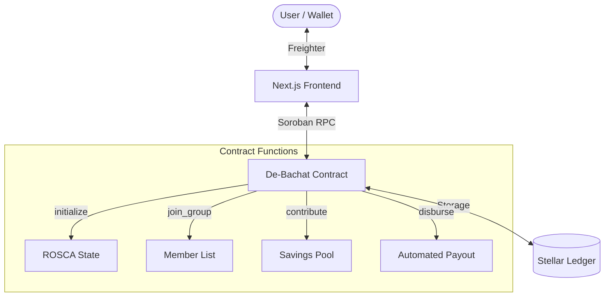

# De-Bachat: Decentralized Rotating Savings & Credit Association (ROSCA)

De-Bachat is a premium Web3 application built on the **Stellar Soroban Testnet**. It enables users to form trusted savings groups (ROSCAs) where participants contribute a fixed amount each cycle, and the total pool is disbursed to one member in rotation.

## 🚀 project Structure

- **`/contracts`**: Soroban smart contract implemented in Rust. Includes logic for enrollment, contribution tracking, and automated payout disbursement.
- **`/frontend`**: A premium Next.js dashboard with Freighter wallet integration, real-time pool state syncing, and organizer controls.
- **`FINAL_CHECKLIST.md`**: Summary of the project milestones and completion state.
- **`TEST_SCENARIO.md`**: Detailed guide for simulating a full 5-wallet savings cycle.

## 🏗️ Architecture



## 🛠️ Tech Stack

- **Smart Contracts**: Rust, Soroban SDK
- **Frontend**: Next.js 15+, Tailwind CSS, Lucide React
- **Blockchain**: Stellar Testnet
- **Wallet**: Freighter

## 🔗 Live Links & Submission

- **Live Demo Link**: [https://de-bachat-stellar.vercel.app/](https://de-bachat-stellar.vercel.app/)
- **Demo Video Link**: [▶️ Watch Demo on Google Drive](https://drive.google.com/file/d/1odzj3ce9iw4KztzjGWZBQEOoo6vZ00eC/view?usp=sharing)

## 👥 User Validation (Level 5)

We have validated this MVP with **5+ real testnet users**. Their feedback has been collected and used to iterate on the product.

- **User Feedback Analysis**: [Link to Feedback Spreadsheet](https://docs.google.com/spreadsheets/d/1rRSr3L0D3mYeXAWOXvHhujNQtJM8vqyTXPusWL-aPN8/edit?usp=sharing)
- **Verified User Wallets**:
- **Verified User Wallets**:
  1. `GAGKWDKAZYZ7GSK2K6YZGGEDEZXL2GEHDU2NMOAU4AVHSFAVZH336FFX` (Mrunal Ghorpade)
  2. `GBUDUGMHCM7B54DIB5P5LP4PP6MG7MJ6VUBBYDB53BZNZCTH36LLG5MG` (Ayush Gaikwad)
  3. `GDR3...KAIK` (Durvesh Dongare)
  4. `GB2GLJVQ5CYJWOLWDQO5LXCM6WH76XQ253XT3WIL6RQWQAZUYNYLMMVS` (Madhura Ghorpade)
  5. `GD3HNNEJR4YA7DP7KBTIYD2X7AWQOEDPXLJQJFF6HMS4JPTTTPFYS4TH` (Rani Ghorpade)

## 🔄 Evolutionary Improvements (Phase 1 Iteration)

Based on user feedback (Ayush Gaikwad: "more options for wallet"), we implemented the following improvement:
- **Improvement**: **Multi-Wallet Architecture**. Refactored the authentication layer to support both **Freighter** and **Albedo** wallets. This allows users without the Freighter extension to interact with the dApp via the Albedo web interface.
- **Commit Link**: [Evolutionary Improvement: Multi-Wallet Support](https://github.com/MrunalGhorpade13/De-Bachat-Stellar/commit/main)

## 🏁 Quick Start

1. **Install Dependencies**:
   ```bash
   cd frontend
   npm install
   ```
2. **Run Locally**:
   ```bash
   npm run dev
   ```
3. **Environment**:
   Ensure `frontend/.env.local` contains the correct `NEXT_PUBLIC_CONTRACT_ID`.

## 📜 Contract Details (Testnet)

- **Contract ID**: `CBII5RAQTZXMD2HOZCGSFGUENHHEFF62SFDUVKOT37MG3YVSJPIDAG2B`
- **Network**: Testnet

---
Built with ❤️ for the Stellar community.
