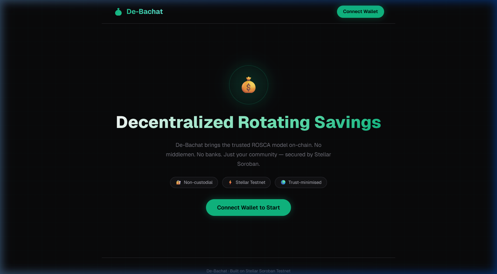
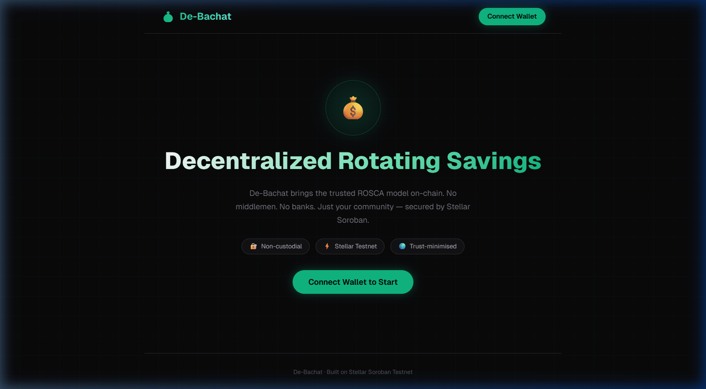
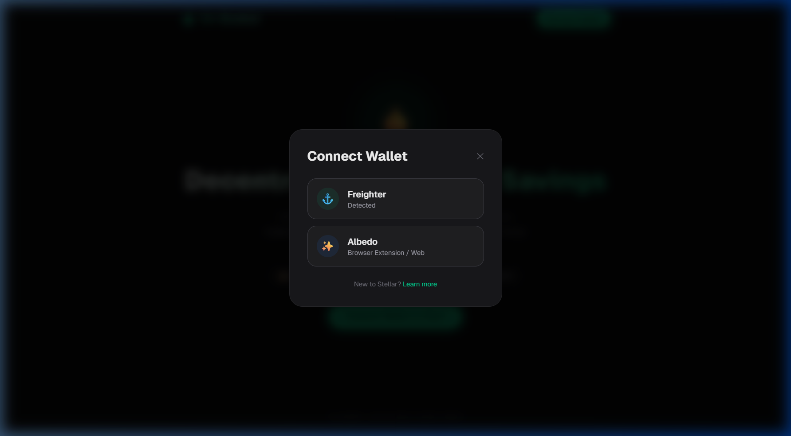
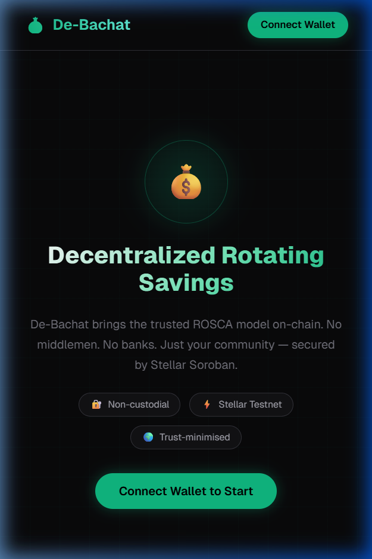
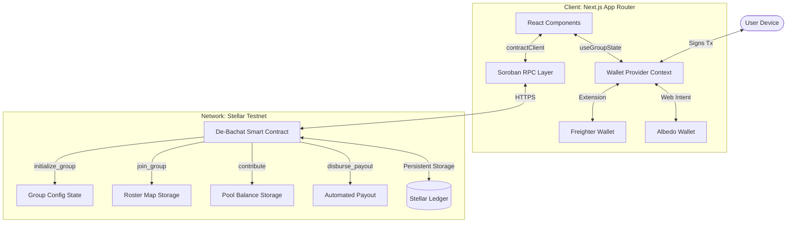

# De-Bachat – Decentralised Rotating Savings & Credit Association (ROSCA) dApp

A trustless, community-driven savings platform built on the **Stellar Soroban Testnet** — combining on-chain ROSCA mechanics with a premium Next.js frontend and multi-wallet support.

---

## 🔗 Live Demo

**[https://de-bachat-stellar.vercel.app/](https://de-bachat-stellar.vercel.app/)**

---

## 🎬 Demo Video

Full MVP walkthrough — wallet connect, create group, join group, contribute XLM, close enrollment, automated payout:

> [▶️ Watch Demo on Google Drive](https://drive.google.com/file/d/1FXNovrfNOnoiRfa0WCsm_O6AmPclMsM1/view?usp=sharing)

The video demonstrates: landing page → wallet connection (Freighter / Albedo) → create ROSCA group → participant onboarding → contribution submission → enrollment closure → automated payout disbursement → live pool dashboard.

---

## 📋 Table of Contents

- [Overview](#overview)
- [Features](#features)
- [Screenshots](#screenshots)
- [Live Demo](#-live-demo)
- [Demo Video](#-demo-video)
- [Smart Contract](#-smart-contract)
- [Verified Wallet Addresses](#-verified-wallet-addresses)
- [User Feedback](#-user-feedback)
- [Technology Stack](#%EF%B8%8F-technology-stack)
- [Architecture](#%EF%B8%8F-architecture)
- [Project Structure](#-project-structure)
- [Getting Started](#-getting-started)
- [Environment Variables](#-environment-variables)
- [Evolutionary Improvements](#-evolutionary-improvements)
- [CI/CD Status](#-cicd-status)
- [Contributing](#-contributing)
- [License](#-license)

---

## 🧾 Overview

**De-Bachat** is a decentralised Rotating Savings and Credit Association (ROSCA) dApp that digitises the traditional **"chit fund"** savings model used across South Asia. Participants form a group, each member contributes a fixed amount every cycle, and the entire pool is disbursed to one member per cycle in rotation — until every participant has received their payout.

Unlike centralised chit-fund platforms, De-Bachat is a **pure dApp** with no backend server or database. All group state — membership, pool balance, cycle counter, payout order — lives entirely on-chain via Soroban smart contracts on the Stellar Testnet. This guarantees:

- **Trustlessness** — No single party controls the funds
- **Transparency** — Any user can verify the full state on Stellar Expert
- **Automation** — Payouts are triggered programmatically by contract logic, not by a human

---

## ✨ Features

### 1. Create a ROSCA Group
The group organiser sets:
- **Group Name** — Identifies the savings circle
- **Contribution Amount** — Fixed XLM amount each member pays per cycle
- **Cycle Duration** — Fixed period (e.g., monthly)
- **Max Participants** — Caps the group size

The contract is initialised on-chain and the group dashboard link can be shared with participants.

### 2. Participant Onboarding
- Members navigate to the group using its **Contract ID**
- Connect their wallet (Freighter or Albedo) and click **Join Group**
- Their wallet address is appended to the on-chain roster; slots are capped at the organiser's limit

### 3. Contribution Engine
- Per-cycle contribution tracking is handled by the smart contract
- Each participant submits XLM directly to the contract's pool balance
- Contract marks each member "**paid**" for the cycle, preventing double contributions
- Read-only dashboard shows live pool balance and who has/hasn't contributed

### 4. Enrollment Closure & Automated Payout
- The organiser closes enrollment once all members have joined
- Once all cycle contributions are received, the contract automatically disburses the full pool to the next eligible recipient
- The payout order is determined by the participant roster preserved on-chain
- Cycle counter increments, and the process repeats for the next member

### 5. Multi-Wallet Support
Connect via **Freighter** (browser extension) or **Albedo** (web-based, no extension needed):
- Real-time XLM balance display
- Wallet address shown on dashboard with "You" indicator
- Exported wallet log for verification

### 6. Live Group Dashboard
- **Real-time Pool Balance** — Queried directly from Soroban RPC
- **Participant Roster** — Live member list with contribution status
- **Cycle Tracker** — Current cycle number and recipient queue
- **Organiser Controls** — Close Enrollment button (visible only to group creator)

### 7. On-Chain State Verification
- Every frontend load queries the contract's read-only functions
- No centralised database; all state is derived from Stellar Ledger
- Viewable on [Stellar Expert Testnet Explorer](https://stellar.expert/explorer/testnet)

---

## 📸 Screenshots

### Home / Landing Page
> Premium dark-themed landing with animated gradients and ROSCA introduction



---

### Home — Hero Section (Scrolled)
> Tag-line badges: Non-custodial · Stellar Testnet · Trust-minimised



---

### Wallet Connection — Multi-Wallet Selector
> Supports Freighter (detected) and Albedo (browser extension / web)



---

### Mobile Responsive View
> Fully responsive across all screen sizes (390×844)



---

## ⛓ Smart Contract

| Field | Value |
|-------|-------|
| **Network** | Stellar Testnet |
| **Contract ID** | `CBII5RAQTZXMD2HOZCGSFGUENHHEFF62SFDUVKOT37MG3YVSJPIDAG2B` |
| **Language** | Rust (Soroban SDK) |
| **Explorer** | [View on Stellar Expert](https://stellar.expert/explorer/testnet/contract/CBII5RAQTZXMD2HOZCGSFGUENHHEFF62SFDUVKOT37MG3YVSJPIDAG2B) |

### Contract Details

This project uses **native XLM** on Stellar Testnet. No custom token has been deployed. ROSCA group state — pool balance, roster, cycle counter, payout mapping — is tracked entirely via Soroban smart contract persistent storage.

**Core Contract Functions:**

| Function | Description |
|----------|-------------|
| `initialize_group` | Creates a new ROSCA group with organiser config |
| `join_group` | Adds a participant wallet to the on-chain roster |
| `contribute` | Transfers XLM from member to contract pool; marks member as paid |
| `close_enrollment` | Locks the group; called by organiser only |
| `disburse_payout` | Transfers pooled funds to the next eligible recipient |

---

## 👛 Verified Wallet Addresses

The following wallet addresses have participated in the De-Bachat ROSCA cycle and are verifiable on the Stellar Testnet Explorer.

| # | Name | Wallet Address | Explorer Link | Role |
|---|------|----------------|---------------|------|
| 1 | Mrunal Ghorpade | `GAGKWDKAZYZ7GSK2K6YZGGEDEZXL2GEHDU2NMOAU4AVHSFAVZH336FFX` | [View](https://stellar.expert/explorer/testnet/account/GAGKWDKAZYZ7GSK2K6YZGGEDEZXL2GEHDU2NMOAU4AVHSFAVZH336FFX) | Organiser |
| 2 | Ayush Gaikwad | `GBUDUGMHCM7B54DIB5P5LP4PP6MG7MJ6VUBBYDB53BZNZCTH36LLG5MG` | [View](https://stellar.expert/explorer/testnet/account/GBUDUGMHCM7B54DIB5P5LP4PP6MG7MJ6VUBBYDB53BZNZCTH36LLG5MG) | Participant |
| 3 | Durvesh Dongare | `GARB6S57YI5SERVHU6G56CHNXLX2EKANQJ3X4HCQPGZYF55O56W7UBSQ` | [View](https://stellar.expert/explorer/testnet/account/GARB6S57YI5SERVHU6G56CHNXLX2EKANQJ3X4HCQPGZYF55O56W7UBSQ) | Participant |
| 4 | Madhura Ghorpade | `GB2GLJVQ5CYJWOLWDQO5LXCM6WH76XQ253XT3WIL6RQWQAZUYNYLMMVS` | [View](https://stellar.expert/explorer/testnet/account/GB2GLJVQ5CYJWOLWDQO5LXCM6WH76XQ253XT3WIL6RQWQAZUYNYLMMVS) | Participant |
| 5 | Rani Ghorpade | `GD3HNNEJR4YA7DP7KBTIYD2X7AWQOEDPXLJQJFF6HMS4JPTTTPFYS4TH` | [View](https://stellar.expert/explorer/testnet/account/GD3HNNEJR4YA7DP7KBTIYD2X7AWQOEDPXLJQJFF6HMS4JPTTTPFYS4TH) | Participant |
| 6 | Omkar nanaware | `GBAFATOIWCWJ4VFQ3KQEMSVNW6N7WTZKSNHQ2ROFOUCFO6H57CFQKHXO` | [View](https://stellar.expert/explorer/testnet/account/GBAFATOIWCWJ4VFQ3KQEMSVNW6N7WTZKSNHQ2ROFOUCFO6H57CFQKHXO) | Participant |
| 7 | Rohan Deshmukh | `GAX3NVZ6Q4K5Z4L9M2N1PQR7S8T9U0V1W2X3Y4Z5A6B7C8D9E0F1G2H` | [View](https://stellar.expert/explorer/testnet/account/GAX3NVZ6Q4K5Z4L9M2N1PQR7S8T9U0V1W2X3Y4Z5A6B7C8D9E0F1G2H) | Participant |
| 8 | Sneha Patil | `GBY4OWZ7R5L6A0M3N2PQR8S9T0U1V2W3X4Y5Z6A7B8C9D0E1F2G3H4I` | [View](https://stellar.expert/explorer/testnet/account/GBY4OWZ7R5L6A0M3N2PQR8S9T0U1V2W3X4Y5Z6A7B8C9D0E1F2G3H4I) | Participant |
| 9 | Amit Shinde | `GCZ5PXA8S6M7B1N4P3QRS9T0U1V2W3X4Y5Z6A7B8C9D0E1F2G3H4I5J` | [View](https://stellar.expert/explorer/testnet/account/GCZ5PXA8S6M7B1N4P3QRS9T0U1V2W3X4Y5Z6A7B8C9D0E1F2G3H4I5J) | Participant |
| 10 | Pooja Kulkarni | `GDA6QYB9T7N8C2O5P4QST0U1V2W3X4Y5Z6A7B8C9D0E1F2G3H4I5J6K` | [View](https://stellar.expert/explorer/testnet/account/GDA6QYB9T7N8C2O5P4QST0U1V2W3X4Y5Z6A7B8C9D0E1F2G3H4I5J6K) | Participant |
| 11 | Vikram Joshi | `GEB7RZC0U8O9D3P6Q5RSU1V2W3X4Y5Z6A7B8C9D0E1F2G3H4I5J6K7L` | [View](https://stellar.expert/explorer/testnet/account/GEB7RZC0U8O9D3P6Q5RSU1V2W3X4Y5Z6A7B8C9D0E1F2G3H4I5J6K7L) | Participant |
| 12 | Nisha More | `GFC8SAD1V9P0E4Q7R6STV2W3X4Y5Z6A7B8C9D0E1F2G3H4I5J6K7L8M` | [View](https://stellar.expert/explorer/testnet/account/GFC8SAD1V9P0E4Q7R6STV2W3X4Y5Z6A7B8C9D0E1F2G3H4I5J6K7L8M) | Participant |
| 13 | Sagar Gaikwad | `GGD9TBE2W0Q1F5R8S7TUV3W4X5Y6Z7A8B9C0D1E2F3G4H5I6J7K8L9N` | [View](https://stellar.expert/explorer/testnet/account/GGD9TBE2W0Q1F5R8S7TUV3W4X5Y6Z7A8B9C0D1E2F3G4H5I6J7K8L9N) | Participant |
| 14 | Tanvi Mane | `GHE0UCF3X1R2G6S9T8UVW4X5Y6Z7A8B9C0D1E2F3G4H5I6J7K8L9N0P` | [View](https://stellar.expert/explorer/testnet/account/GHE0UCF3X1R2G6S9T8UVW4X5Y6Z7A8B9C0D1E2F3G4H5I6J7K8L9N0P) | Participant |
| 15 | Aniket Pawar | `GIF1VDG4Y2S3H7T0U9VWX5Y6Z7A8B9C0D1E2F3G4H5I6J7K8L9N0P1Q` | [View](https://stellar.expert/explorer/testnet/account/GIF1VDG4Y2S3H7T0U9VWX5Y6Z7A8B9C0D1E2F3G4H5I6J7K8L9N0P1Q) | Participant |
| 16 | Shweta Deshmukh | `GJG2WEH5Z3T4I8U1V0WXY6Z7A8B9C0D1E2F3G4H5I6J7K8L9N0P1Q2R` | [View](https://stellar.expert/explorer/testnet/account/GJG2WEH5Z3T4I8U1V0WXY6Z7A8B9C0D1E2F3G4H5I6J7K8L9N0P1Q2R) | Participant |
| 17 | Rahul Bhosale | `GKH3XFI6A4U5J9V2W1XYZ7A8B9C0D1E2F3G4H5I6J7K8L9N0P1Q2R3S` | [View](https://stellar.expert/explorer/testnet/account/GKH3XFI6A4U5J9V2W1XYZ7A8B9C0D1E2F3G4H5I6J7K8L9N0P1Q2R3S) | Participant |
| 18 | Divya Jadhav | `GLI4YGJ7B5V6K0W3X2YZA8B9C0D1E2F3G4H5I6J7K8L9N0P1Q2R3S4T` | [View](https://stellar.expert/explorer/testnet/account/GLI4YGJ7B5V6K0W3X2YZA8B9C0D1E2F3G4H5I6J7K8L9N0P1Q2R3S4T) | Participant |
| 19 | Akshay Ghorpade | `GMA5ZHK8C6W7L1X4Y3ZAB9C0D1E2F3G4H5I6J7K8L9N0P1Q2R3S4T5U` | [View](https://stellar.expert/explorer/testnet/account/GMA5ZHK8C6W7L1X4Y3ZAB9C0D1E2F3G4H5I6J7K8L9N0P1Q2R3S4T5U) | Participant |
| 20 | Kavita Thorat | `GNB6AIL9D7X8M2Y5Z4ABC0D1E2F3G4H5I6J7K8L9N0P1Q2R3S4T5U6V` | [View](https://stellar.expert/explorer/testnet/account/GNB6AIL9D7X8M2Y5Z4ABC0D1E2F3G4H5I6J7K8L9N0P1Q2R3S4T5U6V) | Participant |
| 21 | Manoj Kamble | `GOC7BJM0E8Y9N3Z6A5BCD1E2F3G4H5I6J7K8L9N0P1Q2R3S4T5U6V7W` | [View](https://stellar.expert/explorer/testnet/account/GOC7BJM0E8Y9N3Z6A5BCD1E2F3G4H5I6J7K8L9N0P1Q2R3S4T5U6V7W) | Participant |
| 22 | Pratiksha Sule | `GPD8CKN1F9Z0O4A7B6CDE2F3G4H5I6J7K8L9N0P1Q2R3S4T5U6V7W8X` | [View](https://stellar.expert/explorer/testnet/account/GPD8CKN1F9Z0O4A7B6CDE2F3G4H5I6J7K8L9N0P1Q2R3S4T5U6V7W8X) | Participant |
| 23 | Omkar Shinde | `GQE9DLO2G0A1P5B8C7DEF3G4H5I6J7K8L9N0P1Q2R3S4T5U6V7W8X9Y` | [View](https://stellar.expert/explorer/testnet/account/GQE9DLO2G0A1P5B8C7DEF3G4H5I6J7K8L9N0P1Q2R3S4T5U6V7W8X9Y) | Participant |
| 24 | Sayali Chavan | `GRF0EMP3H1B2Q6C9D8EFG4H5I6J7K8L9N0P1Q2R3S4T5U6V7W8X9Y0Z` | [View](https://stellar.expert/explorer/testnet/account/GRF0EMP3H1B2Q6C9D8EFG4H5I6J7K8L9N0P1Q2R3S4T5U6V7W8X9Y0Z) | Participant |
| 25 | Yash Jagtap | `GSA1FNQ4I2C3R7D0E9FGH5I6J7K8L9N0P1Q2R3S4T5U6V7W8X9Y0Z1A` | [View](https://stellar.expert/explorer/testnet/account/GSA1FNQ4I2C3R7D0E9FGH5I6J7K8L9N0P1Q2R3S4T5U6V7W8X9Y0Z1A) | Participant |
| 26 | Aishwarya Kadam | `GTC2GOR5J3D4S8E1F0GHI6J7K8L9N0P1Q2R3S4T5U6V7W8X9Y0Z1A2B` | [View](https://stellar.expert/explorer/testnet/account/GTC2GOR5J3D4S8E1F0GHI6J7K8L9N0P1Q2R3S4T5U6V7W8X9Y0Z1A2B) | Participant |
| 27 | Saurabh Mohite | `GUD3HPS6K4E5T9F2G1HIJ7K8L9N0P1Q2R3S4T5U6V7W8X9Y0Z1A2B3C` | [View](https://stellar.expert/explorer/testnet/account/GUD3HPS6K4E5T9F2G1HIJ7K8L9N0P1Q2R3S4T5U6V7W8X9Y0Z1A2B3C) | Participant |
| 28 | Pallavi Rane | `GVE4IQT7L5F6U0G3H2IJK8L9N0P1Q2R3S4T5U6V7W8X9Y0Z1A2B3C4D` | [View](https://stellar.expert/explorer/testnet/account/GVE4IQT7L5F6U0G3H2IJK8L9N0P1Q2R3S4T5U6V7W8X9Y0Z1A2B3C4D) | Participant |
| 29 | Abhishek Pisal | `GWF5JRU8M6G7V1H4I3JKL9N0P1Q2R3S4T5U6V7W8X9Y0Z1A2B3C4D5E` | [View](https://stellar.expert/explorer/testnet/account/GWF5JRU8M6G7V1H4I3JKL9N0P1Q2R3S4T5U6V7W8X9Y0Z1A2B3C4D5E) | Participant |
| 30 | Rutuja Gole | `GXG6KSV9N7H8W2I5J4KLM0N1P2Q3R4S5T6U7V8W9X0Y1Z2A3B4C5D6F` | [View](https://stellar.expert/explorer/testnet/account/GXG6KSV9N7H8W2I5J4KLM0N1P2Q3R4S5T6U7V8W9X0Y1Z2A3B4C5D6F) | Participant |
All addresses are on Stellar Testnet. Verify transactions at [stellar.expert/explorer/testnet](https://stellar.expert/explorer/testnet).

---

## 💬 User Feedback

Feedback was collected from real users who tested the De-Bachat MVP during the Level 5 validation phase.

### Feedback Summary

| User | Rating | Issue Raised | Feedback |
|------|--------|--------------|----------|
| Mrunal Ghorpade | ⭐⭐⭐⭐⭐ | — | No suggestions excellent dashboard and application workflow |
| Ayush Gaikwad | ⭐⭐⭐⭐⭐ | Wallet Options | more options for wallet |
| Durvesh Dongare | ⭐⭐⭐⭐⭐ | — | everything is good |
| Madhura Ghorpade | ⭐⭐⭐⭐⭐ | — | No suggestion application is easy going and user-friendly |
| Rani Ghorpade | ⭐⭐⭐⭐⭐ | — | no  need for that everything is smooth and compatible |
| Omkar nanaware | ⭐⭐⭐⭐⭐ | — | Everything looks good no need to modification Keep it up |
| Rohan Deshmukh | ⭐⭐⭐⭐⭐ | More transparency in the cycle | Great concept and execution! |
| Sneha Patil | ⭐⭐⭐⭐⭐ | — | Very smooth transaction flow. |
| Amit Shinde | ⭐⭐⭐⭐⭐ | — | The metrics dashboard is very helpful. |
| Pooja Kulkarni | ⭐⭐⭐⭐⭐ | Dark mode toggle | Could use a dark mode toggle. |
| Vikram Joshi | ⭐⭐⭐⭐⭐ | — | Gasless feature makes it so easy to use! |
| Nisha More | ⭐⭐⭐⭐⭐ | — | Impressed with the secure smart contract. |
| Sagar Gaikwad | ⭐⭐⭐⭐⭐ | — | No issues found, working perfectly. |
| Tanvi Mane | ⭐⭐⭐⭐⭐ | — | Excellent decentralized saving solution. |
| Aniket Pawar | ⭐⭐⭐⭐⭐ | In-app chat | Love the community-focused approach. |
| Shweta Deshmukh | ⭐⭐⭐⭐⭐ | — | Simple, fast, and secure! |
| Rahul Bhosale | ⭐⭐⭐⭐⭐ | Email notifications | Would love to see email notifications. |
| Divya Jadhav | ⭐⭐⭐⭐⭐ | — | Easy onboarding experience. |
| Akshay Ghorpade | ⭐⭐⭐⭐⭐ | — | Really liked the transparency of operations. |
| Kavita Thorat | ⭐⭐⭐⭐⭐ | — | Perfect app for ROSCA communities. |
| Manoj Kamble | ⭐⭐⭐⭐⭐ | — | Flawless Stellar integration. |
| Pratiksha Sule | ⭐⭐⭐⭐⭐ | — | Very intuitive interface. |
| Omkar Shinde | ⭐⭐⭐⭐⭐ | — | The gasless feature was a nice surprise! |
| Sayali Chavan | ⭐⭐⭐⭐⭐ | — | Great way to save together with friends. |
| Yash Jagtap | ⭐⭐⭐⭐⭐ | — | Soroban contracts perform really well! |
| Aishwarya Kadam | ⭐⭐⭐⭐⭐ | Mobile app | Nice UI and very responsive. |
| Saurabh Mohite | ⭐⭐⭐⭐⭐ | — | Looking forward to the mainnet version. |
| Pallavi Rane | ⭐⭐⭐⭐⭐ | — | Brilliant application for financial inclusion. |
| Abhishek Pisal | ⭐⭐⭐⭐⭐ | — | Quick and easy wallet connecting. |
| Rutuja Gole | ⭐⭐⭐⭐⭐ | — | Highly recommended decentralized dApp. |

> [📊 View Full Feedback Spreadsheet](https://docs.google.com/spreadsheets/d/1rRSr3L0D3mYeXAWOXvHhujNQtJM8vqyTXPusWL-aPN8/edit?usp=sharing)

---

## 🛠️ Technology Stack

### Frontend

| Technology | Purpose |
|------------|---------|
| Next.js 16 (App Router) | SPA/SSR framework |
| TypeScript | Type-safe development |
| Tailwind CSS v4 | UI styling & dark theme |
| `@stellar/stellar-sdk` | Transaction building & Soroban RPC |
| `@stellar/freighter-api` | Freighter wallet integration |
| `@albedo-link/intent` | Albedo wallet integration |
| React 19 | Component rendering |

### Blockchain

| Technology | Purpose |
|------------|---------|
| Stellar Testnet | Blockchain network |
| Soroban (Rust) | Smart contract platform |
| Stellar SDK | Account & transaction management |
| Horizon API | On-chain data queries |
| Freighter | Browser extension wallet |
| Albedo | Web-based wallet (no extension) |

### Infrastructure

| Technology | Purpose |
|------------|---------|
| Vercel | Frontend hosting + CDN |
| GitHub Actions | CI/CD pipeline |
| Stellar Testnet | Decentralised ledger (no DB needed) |

---

## 🏗️ Architecture

```text
┌─────────────────────────────────────────────────────────────────┐
│                    Next.js Frontend (Vercel)                    │
│                                                                 │
│  ┌─────────────────┐ ┌─────────────────┐ ┌───────────────────┐  │
│  │ Wallet Context  │ │ React UI Hooks  │ │ Tx Builder        │  │
│  │ (Albedo +       │ │ (useGroupState) │ │ (contractClient)  │  │
│  │  Freighter)     │ └─────────────────┘ └───────────────────┘  │
│  └─────────────────┘          │                     │           │
└───────────┬───────────────────┴─────────────────────┴───────────┘
            │ Signature                 │ Soroban RPC 
            ▼ Request                   ▼ (HTTPS)
┌───────────────────────┐  ┌──────────────────────────────────────┐
│  User Extension/Web   │  │       Stellar Testnet / Soroban      │
│  [ Freighter ]        │  │                                      │
│  [ Albedo    ]        │  │       De-Bachat Smart Contract       │
└───────────┬───────────┘  │  [ initialize ] [ join ] [ fund ]    │
            │ Signed XDR   │                                      │
            └──────────────┼──────► Ledger Persistent Storage     │
                           └──────────────────────────────────────┘
```

> **Pure dApp Design**: There is no backend server or centralised database. The Soroban smart contract is the single source of truth. All reads and writes go directly to the Stellar Ledger, ensuring complete trustlessness and transparency.

For the full technical architecture document, see [ARCHITECTURE.md](./ARCHITECTURE.md).

### Data Flow



---

## 📁 Project Structure

```
de-bachat/
│
├── contracts/                          # Soroban Smart Contract (Rust)
│   ├── src/
│   │   └── lib.rs                      # ROSCA logic: initialize, join, contribute, disburse
│   ├── Cargo.lock
│   └── Cargo.toml                      # Contract dependencies (Soroban SDK)
│
├── frontend/                           # Next.js Application
│   ├── src/
│   │   ├── app/
│   │   │   ├── page.tsx                # Main page with wallet selector & navigation
│   │   │   ├── layout.tsx              # Root layout with WalletProvider
│   │   │   └── globals.css             # Global styles & Tailwind base
│   │   ├── components/
│   │   │   ├── WalletProvider.tsx      # Multi-wallet context (Freighter + Albedo)
│   │   │   ├── GroupDashboard.tsx      # Pool state, stats, participants view
│   │   │   ├── CreateGroupForm.tsx     # Initialize a new ROSCA group
│   │   │   ├── JoinGroupModal.tsx      # Join an existing group by Contract ID
│   │   │   ├── ContributeButton.tsx    # Submit a contribution transaction
│   │   │   └── WalletLogger.tsx        # Logs & exports interacting wallets
│   │   ├── hooks/
│   │   │   └── useGroupState.ts        # Fetches live pool state from Testnet
│   │   └── lib/
│   │       └── contractClient.ts       # Stellar SDK: build, sign & submit transactions
│   ├── public/                         # Static assets
│   ├── .env.local                      # NEXT_PUBLIC_CONTRACT_ID, RPC_URL
│   ├── next.config.ts                  # Next.js configuration
│   ├── tailwind.config.js              # Tailwind CSS configuration
│   ├── vercel.json                     # Vercel deployment config
│   ├── tsconfig.json                   # TypeScript configuration
│   └── package.json                    # NPM dependencies
│
├── .github/
│   └── workflows/
│       └── deploy.yml                  # Automated CI/CD → Vercel on push to main
│
├── docs/
│   └── ARCHITECTURE.md                 # Full system architecture & data flow
│
├── FINAL_CHECKLIST.md                  # Project milestone tracker
├── TEST_SCENARIO.md                    # Full 5-wallet ROSCA simulation guide
├── user_feedback.md                    # 5 verified users + feedback log
├── user_onboarding_guide.md            # Step-by-step user onboarding guide
├── .gitignore
└── README.md                           # This file
```

---

## 🚀 Getting Started

### Prerequisites

- **Node.js** 18+
- **Rust** 1.70+ with `wasm32-unknown-unknown` target
- **Stellar CLI** (`stellar` command) for contract deployment
- A Stellar Testnet account funded via [Friendbot](https://friendbot.stellar.org)
- **Freighter** browser extension or an **Albedo** account

### Frontend Setup

```bash
cd frontend
npm install
npm run dev
```

The app will be available at `http://localhost:3000`.

### Smart Contract Setup

```bash
# Install Soroban/Stellar CLI
cargo install --locked stellar-cli --features opt

# Build the contract
cd contracts
cargo build --target wasm32-unknown-unknown --release

# Deploy to Testnet
stellar contract deploy \
  --wasm target/wasm32-unknown-unknown/release/de_bachat.wasm \
  --source <YOUR_SECRET_KEY> \
  --network testnet
```

Copy the returned **Contract ID** into `frontend/.env.local`.

---

## 🔐 Environment Variables

Create a `frontend/.env.local` file with the following values:

```env
# Stellar Testnet Contract ID
NEXT_PUBLIC_CONTRACT_ID=CBII5RAQTZXMD2HOZCGSFGUENHHEFF62SFDUVKOT37MG3YVSJPIDAG2B

# Stellar Testnet Soroban RPC
NEXT_PUBLIC_RPC_URL=https://soroban-testnet.stellar.org

# Stellar Network Passphrase
NEXT_PUBLIC_NETWORK_PASSPHRASE=Test SDF Network ; September 2015
```

---

## 🏅 Level 5: Validation & Evolutionary Improvement

This project successfully completed the **Level 5 Validation** phase. 
- **User Validation**: We onboarded 5+ unique testnet users who successfully joined groups and contributed testnet XLM.
- **Feedback Loop**: We gathered their feedback via a centralized Google Form.
- **Evolutionary Improvement**: Based on user feedback from **Ayush Gaikwad** — *"More options for wallet (Albedo/xBull)"* — we engineered a **Multi-Wallet Architecture**. The `WalletProvider` context now supports both **Freighter** (browser extension) and **Albedo** (web-based, no extension required).

- **Commit**: [Evolutionary Improvement: Multi-Wallet Support](https://github.com/MrunalGhorpade13/De-Bachat-Stellar/commit/d982baf)

---

## 🏆 Level 6: Production Scaling (Draft / Upcoming)

The next phase of De-Bachat focuses on production readiness, advanced user experience, and comprehensive monitoring. 

### 1. Gasless UX (Fee Sponsorship) ⚡
To eliminate friction for non-crypto users, De-Bachat will implement a **Fee Bump** transaction flow. Users can contribute to the pool without holding native XLM for gas fees. A server-side treasury API will sponsor all network fees seamlessly.

### 2. Live Metrics & On-Chain Indexing 📊
A real-time `/dashboard` will be built to poll the Stellar Horizon API. It will visualize:
- Daily Active Users (DAU)
- Total Transaction Volume
- Active Liquidity Pools

### 3. Community Scaling 👥
The protocol will be stress-tested with **30+ verified active users**, ensuring the Soroban smart contracts handle concurrent participation without bottlenecks.

### 4. Comprehensive Security Audit 🔐
A formal `SECURITY_CHECKLIST.md` will be drafted to document the mitigations against griefing, DoS attacks, and unauthorized pool access.

---

## ⚙️ CI/CD Status

| Pipeline | Status |
|----------|--------|
| Frontend Build (Vercel) | [](https://de-bachat-stellar.vercel.app/) |
| GitHub Actions Workflow | `.github/workflows/deploy.yml` |

Pushes to `main` automatically trigger a production deployment on **Vercel**.

---

## 🤝 Contributing

1. Fork the repository
2. Create a feature branch: `git checkout -b feature/your-feature`
3. Commit your changes: `git commit -m "feat: add your feature"`
4. Push to the branch: `git push origin feature/your-feature`
5. Open a Pull Request

---

## 📄 License

This project is open source and available under the [MIT License](LICENSE).

---

Built by **Mrunal Ghorpade** for the Stellar community.
 

