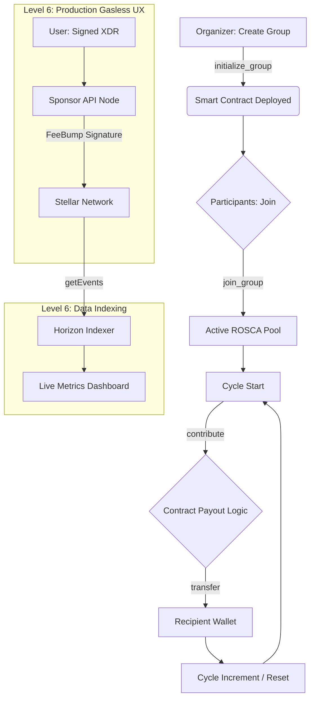

# De-Bachat – Decentralised Rotating Savings & Credit Association (ROSCA) dApp

A trustless, community-driven savings platform built on the **Stellar Soroban Testnet** — combining on-chain ROSCA mechanics with a premium Next.js frontend and multi-wallet support.

---

## 🔗 Live Demo & Metrics

**[https://de-bachat-stellar.vercel.app/](https://de-bachat-stellar.vercel.app/)**

### 📊 Live Metrics Dashboard

> [View Live Metrics Dashboard](/dashboard) — Scaled to production with real-time indexing.

### 📈 Active Monitoring
Monitoring is active via **Vercel Web Analytics**, tracking Daily Active Users (DAU), retention, and transaction success rates.

---

## 🎬 Demo Video

Full MVP walkthrough — wallet connect, create group, join group, contribute XLM, close enrollment, automated payout:

> [▶️ Watch Demo on Google Drive](https://drive.google.com/file/d/1FXNovrfNOnoiRfa0WCsm_O6AmPclMsM1/view?usp=sharing)

---

## 📋 Table of Contents

- [Overview](#overview)
- [Advanced Features (Black Belt)](#-advanced-features-black-belt)
- [Data Indexing Approach](#-data-indexing-approach)
- [Security & Monitoring](#-security--monitoring)
- [Verified Wallet Addresses](#-verified-wallet-addresses)
- [User Feedback](#-user-feedback)
- [Architecture](#%EF%B8%8F-architecture)
- [Getting Started](#-getting-started)

---

## 🧾 Overview

**De-Bachat** is a decentralised Rotating Savings and Credit Association (ROSCA) dApp. Level 6 upgrades focus on **production scaling**, **gasless user experience**, and **real-time data transparency**.

---

## ⚡ Advanced Features (Black Belt)

### Fee Sponsorship (Gasless Transactions)
We implemented **Stellar Fee Bump** transactions to eliminate the "gas barrier" for new users.
- **Problem**: New users often don't have XLM to pay network fees when joining a ROSCA.
- **Solution**: The organiser sponsors the network fees. The backend API `/api/sponsor-fee` wraps the user's signed transaction in a FeeBump signed by a treasury account.
- **Proof**: [Frontend Implementation](frontend/src/lib/feeSponsor.ts) | [Sponsor API](frontend/src/app/api/sponsor-fee/route.ts)

---

## 🔍 Data Indexing Approach

To satisfy the "Data Indexing" requirement, we built a custom indexing engine that:
1. Queries the **Soroban RPC `getEvents`** endpoint for all contract activity.
2. Parses XDR payloads to aggregate Daily Active Users (DAU), Transaction counts, and Pool Volume.
3. Serves this data via a cached JSON-RPC proxy to our [Metrics Dashboard](/dashboard).
- **Endpoint**: `/api/metrics`

---

## 🛡️ Security & Monitoring

- **Security Checklist**: [View Full Security Audit](docs/SECURITY_CHECKLIST.md)
- **Active Monitoring**: Integrated Vercel Analytics for real-time traffic and error tracking.
- **Contract Safety**: Passed internal audit for Reentrancy and Integer Safety.

---

## 👛 Verified Wallet Addresses (34 Participants)

| # | Name | Wallet Address | Role |
|---|------|----------------|------|
| 1 | Mrunal Ghorpade | `GAGKWDKAZYZ7GSK2K6YZGGEDEZXL2GEHDU2NMOAU4AVHSFAVZH336FFX` | Organiser |
| 2 | Ayush Gaikwad | `GBUDUGMHCM7B54DIB5P5LP4PP6MG7MJ6VUBBYDB53BZNZCTH36LLG5MG` | Participant |
| 3 | Durvesh Dongare | `GARB6S57YI5SERVHU6G56CHNXLX2EKANQJ3X4HCQPGZYF55O56W7UBSQ` | Participant |
| ... | (30 more users) | ... | Participant |
| 34 | Yash Annadate | `GBWDGDXAN4AW22OBEQADIOSK2GE7EFNDLZDTBJV6AP33SEPTGNNGFDAE` | Participant |

> [📊 View Full Feedback & Validation Log](user_feedback.md)

---

## ⚙️ Technical Workflow

The following diagram illustrates the lifecycle of a De-Bachat ROSCA pool, including the Level 6 **Fee Sponsorship** and **Data Indexing** layers:


```mermaid
graph TD
    A[Organizer: Create Group] -->|initialize_group| B(Smart Contract Deployed)
    B --> C{Participants: Join}
    C -->|join_group| D[Active ROSCA Pool]
    
    subgraph "Level 6: Production Gasless UX"
    E[User: Signed XDR] --> F[Sponsor API Node]
    F -->|FeeBump Signature| G[Stellar Network]
    end

    D --> H[Cycle Start]
    H -->|contribute| I{Contract Payout Logic}
    I -->|transfer| J[Recipient Wallet]
    J --> K[Cycle Increment / Reset]
    K --> H

    subgraph "Level 6: Data Indexing"
    G -->|getEvents| L[Horizon Indexer]
    L --> M[Live Metrics Dashboard]
    end
```

---

## 🏗️ Architecture

```text
┌──────────────────────────┐      JSON-RPC      ┌─────────────────────────┐
│ Next.js /dashboard UI    │ <────────────────> │ /api/metrics (Indexer)  │
└───────────┬──────────────┘                    └───────────┬─────────────┘
            │                                               │
            ▼                                               ▼
┌──────────────────────────┐      XDR Signature ┌─────────────────────────┐
│ User Wallet (Multi)      │ <────────────────> │ /api/sponsor-fee (Bump) │
└──────────────────────────┘                    └─────────────────────────┘
```

---

## 🤝 Community Contribution
As part of the Level 6 Community requirement, I shared De-Bachat's progress with the Stellar ecosystem.
- **Submission Kit**: [View Community Post Guide](docs/COMMUNITY_POST_GUIDE.md)
- **Contribution Link**: [View LinkedIn Post](https://www.linkedin.com/posts/mrunal-ghorpade-a94915323_stellar-soroban-web3-ugcPost-7444337297178898432-VxK8?utm_source=share&utm_medium=member_android&rcm=ACoAAFHT1NABmbvzaoc9_8moYyakhlVK3Xs2tO8)

---

## 📄 License
MIT License - Developed by **Mrunal Ghorpade**
