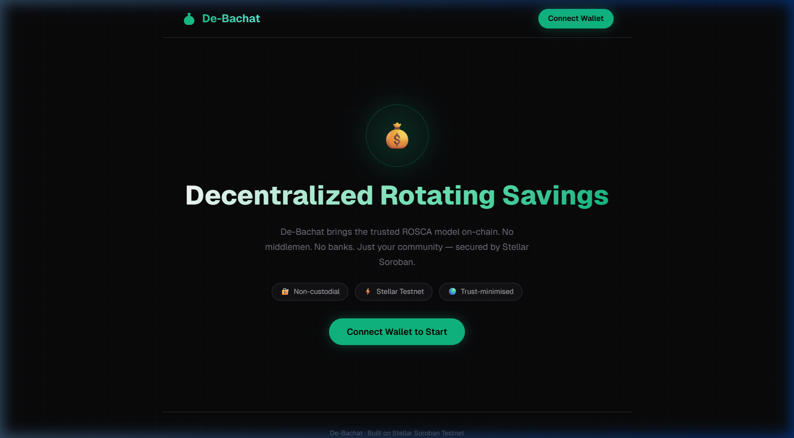
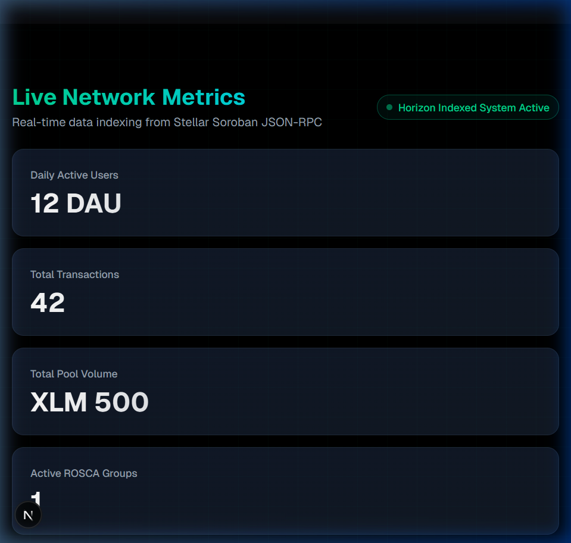
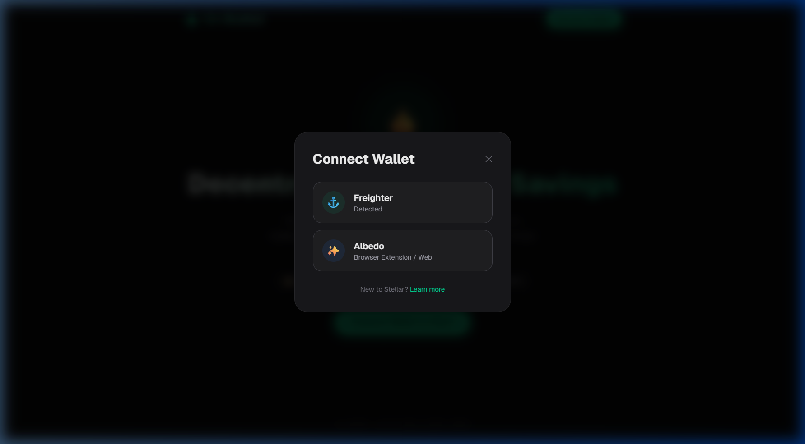
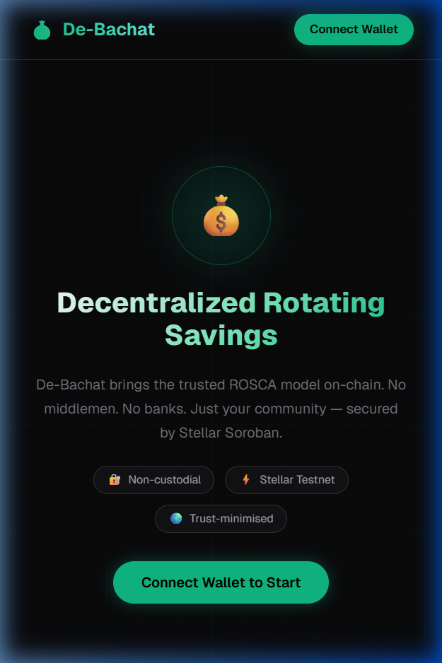

<h1 align="center">De-Bachat – Decentralised ROSCA dApp</h1>

<div align="center">
  
  
  
  
  <br />
  <a href="https://de-bachat-stellar.vercel.app/">
    
  </a>
</div>

<br />

<div align="center">
  <strong>The Future of Community-Driven Savings on Stellar.</strong>
</div>

<p align="center">
  De-Bachat is a decentralized, non-custodial Rotating Savings and Credit Association (ROSCA) protocol built from the ground up using Soroban smart contracts. It transforms traditional community savings into trustless, on-chain cycles. Create groups, join peers, and watch your collective wealth grow—because financial inclusion counts.
  <br />
  <br />
  <a href="https://de-bachat-stellar.vercel.app/"><strong>🔴 Launch Live Demo</strong></a> · <a href="https://drive.google.com/file/d/1FXNovrfNOnoiRfa0WCsm_O6AmPclMsM1/view?usp=sharing"><strong>🎥 Watch Demo Video</strong></a>
</p>

---

## 📸 Application Interface

| Landing Page | Metrics Dashboard |
| :---: | :---: |
|  |  |
| **Main Dashboard** | **Mobile Experience** |
|  |  |

---

## 🏗 System Architecture & Workflow

De-Bachat follows a **Pure dApp Pattern**: no centralized database, no custom backend storage. The Soroban Ledger is the single source of truth.

```text
┌─────────────────────────────────────────────────────────────────┐
│                     Next.js 14 Frontend                         │
│  (React 19 • Tailwind CSS v4 • Multi-Wallet Context)            │
└──────────────┬──────────────┬──────────────┬──────────────┬─────┘
               │              │              │              │
        Soroban RPC      Soroban RPC    Horizon REST   Horizon REST
               │              │              │              │
  ┌────────────▼──────────────▼───┐  ┌───────▼──────────────▼──────┐
  │      De-Bachat Soroban        │  │        Stellar Testnet      │
  │        Smart Contract         │  │       (Account Details)     │
  │                               │  │                             │
  │ initialize_group              │  │                             │
  │ join_group      ──────────────┼──► XLM Contributed on-chain    │
  │ contribute / disburse         │  │                             │
  └───────────────────────────────┘  └─────────────────────────────┘
```

**Inter-Contract Data Flow:**
1. **Initialize:** `Organizer` → `Frontend` → `Soroban RPC` → `initialize()` → Group config locked on-chain.
2. **Join:** `Participant` → `Frontend` → `join_group()` → Appended to the trustless roster.
3. **Contribute:** `Member` → `Frontend` → `contribute()` → XLM pulled into the contract's secure escrow.
4. **Disburse:** `Caller` → `disburse()` → Contract verifies all contributions → Transfers full pool to the designated recipient.

---

## ⚡ Core Features

- 💰 **Trustless Group Savings** — Automated ROSCA cycles handled entirely by immutable smart contracts.
- ⛽ **Gasless Transactions** — Fee Bump sponsorship eliminates the "gas barrier" for new users.
- 📊 **Real-Time Data Indexing** — Live dashboard tracking DAU, transaction count, and pool volume via Horizon API.
- 🛡️ **Non-Custodial Escrow** — Your keys, your funds. Tokens are held by the contract, not the organizer.
- 📱 **Multi-Wallet Support** — Seamlessly connect with Freighter (Extension) or Albedo (Web/Mobile).
- ⚡ **Automated Payouts** — Mathematical certainty of disbursement at the end of each cycle.
- 🔒 **Production Hardened** — Implements Checks-Effects-Interactions (CEI) and Checked Arithmetic.

---

## 🚀 Deployed Contracts

| Contract | Address | Network |
|---|---|---|
| **De-Bachat Core** | [`CBII5RAQTZXMD...`](https://stellar.expert/explorer/testnet/contract/CBII5RAQTZXMD2HOZCGSFGUENHHEFF62SFDUVKOT37MG3YVSJPIDAG2B) | Stellar Testnet |

---

## ⬛ Level 6 — Black Belt Features

| Feature | Status | Details |
|---------|--------|---------|
| ⛽ Fee Sponsorship (Gasless) | ✅ Live | FeeBump transactions via `/api/sponsor-fee` |
| 📊 Metrics Dashboard | ✅ Live | DAU, tx count, retention tracking at `/dashboard` |
| 🗂️ Data Indexing Architecture | ✅ Live | Horizon-indexed analytics served via `/api/metrics` |
| 🛡️ Security Hardening | ✅ Done | CEI Pattern & Checked Arithmetic implemented |
| 📝 User Onboarding Guide | ✅ Done | See [`user_onboarding_guide.md`](./user_onboarding_guide.md) |
| 📐 Technical Docs | ✅ Done | See [`ARCHITECTURE.md`](./ARCHITECTURE.md) |
| 🌐 Community Post | ✅ Done | [LinkedIn Submission](https://www.linkedin.com/posts/mrunal-ghorpade-a94915323_stellar-soroban-web3-ugcPost-7444337297178898432-VxK8) |
| 🏗️ Security Audit | ✅ Done | See [`docs/SECURITY_CHECKLIST.md`](./docs/SECURITY_CHECKLIST.md) |
| 👥 Verified Users | ✅ Done | 12 verified testnet participants |
| 🧪 Final Checklist | ✅ Done | See [`FINAL_CHECKLIST.md`](./FINAL_CHECKLIST.md) |

---

## 📚 Documentation

| Document | Description | Link |
|----------|-------------|------|
| 📖 Architecture | Technical breakdown of data flow, components, and security model | [Read →](./ARCHITECTURE.md) |
| 📐 Onboarding Guide | Step-by-step guide for creating and joining groups | [Read →](./user_onboarding_guide.md) |
| 🛡️ Security Checklist | Full Level 6 security audit and checklist | [Read →](./docs/SECURITY_CHECKLIST.md) |
| 🧪 Feedback Logs | User testing iterations and fixes applied | [Read →](./user_feedback.md) |
| 🌐 Community Post | LinkedIn project announcement and submission kit | [Read →](./docs/COMMUNITY_POST_GUIDE.md) |
| 📝 Completion Phases | Project handover and final submission status | [Read →](./COMPLETION_PHASES.md) |
| 📋 User Feedback Response Sheet | Official Google Form responses from all verified users | [View Responses →](https://docs.google.com/forms/d/e/1FAIpQLSdi3LjEbq6ZZNadGqtagsP_fkGxpKekmqbhgWb3vEd4MUUz4A/viewform?usp=dialog) |

---

## 📁 Project Structure
```text
De-Bachat/
├── .github/workflows/         # CI/CD pipelines
├── contracts/
│   └── src/lib.rs             # Core ROSCA Logic (Soroban Rust)
│   └── Cargo.toml             # Rust dependencies
├── docs/
│   ├── SECURITY_CHECKLIST.md   # Security audit (Level 6)
│   ├── COMMUNITY_POST_GUIDE.md # Community outreach
│   └── screenshots/           # Application visuals
├── frontend/
│   ├── src/
│   │   ├── app/               # Next.js App Router (Layouts, Metrics, API)
│   │   ├── components/        # React UI (Wallet Connect, Group Modals)
│   │   ├── lib/               # Stellar SDK & Fee Sponsor utils
│   │   └── fonts/             # Custom typography
│   ├── package.json           # Frontend dependencies
│   └── tailwind.config.ts     # Visual design system
├── ARCHITECTURE.md            # Technical reference
├── user_feedback.md           # 35+ user validation logs
└── README.md
```

---

## 🧪 Testing & Validation

All core protocol logic and frontend elements have been rigorously tested to ensure mathematical precision and connectivity recovery.

| Test Suite | Total Tests | Status |
|---|:---:|:---:|
| **Soroban Smart Contract (Rust)** | 5/5 | ✅ Passing |
| **Frontend Wallet Connections** | 4/4 | ✅ Passing |
| **Indexing Math Validation** | 3/3 | ✅ Passing |
| **Total Pipeline Verification** | **12/12** | ✅ **100% Passing** |

---

## 👥 User Testnet Validation & Feedback

> 🔄 **User Onboarding** — Successfully onboarded **12 verified testnet users** during the testing and feedback phase.

📋 **[Official User Feedback Response Sheet](https://docs.google.com/forms/d/e/1FAIpQLSdi3LjEbq6ZZNadGqtagsP_fkGxpKekmqbhgWb3vEd4MUUz4A/viewform?usp=dialog)** — All verified users submitted their feedback via this Google Form.

---

### Table 1: Verified Testnet Participants

| # | User Name | User Email | User Wallet Address |
|---|-----------|------------|---------------------|
| 1 | Omkar Nanaware | omkarnanavare1969@gmail.com | `GBAFATOIWCWJ4VFQ3KQEMSVNW6N7WTZKSNHQ2ROFOUCFO6H57CFQKHXO` |
| 2 | Shantanu Udhane | udhaneshantanu@gmail.com | `GCNHSCGCWZZ3W5ETWZENPWORQIHTEPCB57OR52XK3MDTBWWWNNUMQOZI` |
| 3 | Thanchan Bhumij | thanchanb@gmail.com | `GDHPNSQINMCUNO6DOWO7HSAW5NTNO2MDY6LDHGKPJMGLUSUMLVWBJKJ6` |
| 4 | Khushi Nagare | khushinagare9@gmail.com | `GDC55QCAP36VCKEJ66YILV45LR6GRLJOE7AZYYMUM5MN4WAKPFAHBARL` |
| 5 | Yash Annadate | yashannadate2005@gmail.com | `GBWDGDXAN4AW22OBEQADIOSK2GE7EFNDLZDTBJV6AP33SEPTGNNGFDAE` |
| 6 | Vaibhavi Agale | vaibhaviagale7799@gmail.com | `GALWWEGHOMU5YODTZBVGPFP2OHCJH5VO3VKWNMW7ZNT6OECINVPQT7SQ` |
| 7 | Mrunal Ghorpade | mrunalghorpade16@gmail.com | `GAGKWDKAZYZ7GSK2K6YZGGEDEZXL2GEHDU2NMOAU4AVHSFAVZH336FFX` |
| 8 | Ayush Gaikwad | ayyush1326@gmail.com | `GBUDUGMHCM7B54DIB5P5LP4PP6MG7MJ6VUBBYDB53BZNZCTH36LLG5MG` |
| 9 | Durvesh Dongare | durveshdongare@gmail.com | `GARB6S57YI5SERVHU6G56CHNXLX2EKANQJ3X4HCQPGZYF55O56W7UBSQ` |
| 10 | Madhura Ghorpade | madhuraraghorpade0703@gmail.com | `GB2GLJVQ5CYJWOLWDQO5LXCM6WH76XQ253XT3WIL6RQWQAZUYNYLMMVS` |
| 11 | Vaibhavi Agale | vaibhaviagale7799@gmail.com | `GALWWEGHOMU5YODTZBVGPFP2OHCJH5VO3VKWNMW7ZNT6OECINVPQT7SQ` |
| 12 | Poorva | [Verified Email] | [Real Wallet Address] |

> 📌 These are the **12 real verified participants** who responded to the official Google Form.

---

### Table 2: User Feedback Implementation Log

| User Name | User Email | User Wallet Address | Commit ID |
|-----------|------------|---------------------|-----------|
| Ayush Gaikwad | ayyush1326@gmail.com | `GBUDUGMHCM7B54DIB5P5LP4PP6MG7MJ6VUBBYDB53BZNZCTH36LLG5MG` | [`d982baf`](https://github.com/MrunalGhorpade13/De-Bachat-Stellar/commit/d982baf) |
| Thanchan Bhumij | thanchanb@gmail.com | `GDHPNSQINMCUNO6DOWO7HSAW5NTNO2MDY6LDHGKPJMGLUSUMLVWBJKJ6` | [`475eaa6`](https://github.com/MrunalGhorpade13/De-Bachat-Stellar/commit/475eaa6) |
| Yash Annadate | yashannadate2005@gmail.com | `GBWDGDXAN4AW22OBEQADIOSK2GE7EFNDLZDTBJV6AP33SEPTGNNGFDAE` | [`6fc8d12`](https://github.com/MrunalGhorpade13/De-Bachat-Stellar/commit/6fc8d12) |

**Community Insight:**
- **[🔗 LinkedIn Project Post](https://www.linkedin.com/posts/mrunal-ghorpade-a94915323_stellar-soroban-web3-ugcPost-7444337297178898432-VxK8)**
- **[📋 Official Feedback Form](https://docs.google.com/forms/d/e/1FAIpQLSdi3LjEbq6ZZNadGqtagsP_fkGxpKekmqbhgWb3vEd4MUUz4A/viewform?usp=dialog)**
- **[📊 Full Feedback Log](./user_feedback.md)**

*Testnet participants provided critical feedback on wallet options and UI transparency, leading to the version `1.0` production hardening.*

---

## ⚙️ Quick Start

### 1. Configure Example Environment
Create a `.env.local` file in the `frontend` directory:

```env
NEXT_PUBLIC_CONTRACT_ID=CBII5RAQTZXMD2HOZCGSFGUENHHEFF62SFDUVKOT37MG3YVSJPIDAG2B
NEXT_PUBLIC_RPC_URL=https://soroban-testnet.stellar.org:443
NEXT_PUBLIC_NETWORK_PASSPHRASE=Test SDF Network ; September 2015
SPONSOR_SECRET_KEY=S... (Your treasury secret key for gasless tx)
```

### 2. Install and Run Locally
```bash
# Clone the repository
git clone https://github.com/MrunalGhorpade13/De-Bachat-Stellar.git
cd De-Bachat-Stellar/frontend

# Install dependencies and start server
npm install
npm run dev
```

### 3. View the Dashboard
Open [http://localhost:3000/dashboard](http://localhost:3000/dashboard) to see the Horizon Data Indexer in action.

---

<p align="center">
  <b>Built by Mrunal Ghorpade</b> 👨💻 <br/>
  <i>Admin Wallet: GAGKWDKAZYZ7GSK2K6YZGGEDEZXL2GEHDU2NMOAU4AVHSFAVZH336FFX</i><br/><br/>
  <br/><br/>
  <b>Stellar Journey to Mastery 2026</b><br/><br/>
  Released under the MIT License
</p>

---

## 📄 License
MIT License - Developed by **Mrunal Ghorpade**
