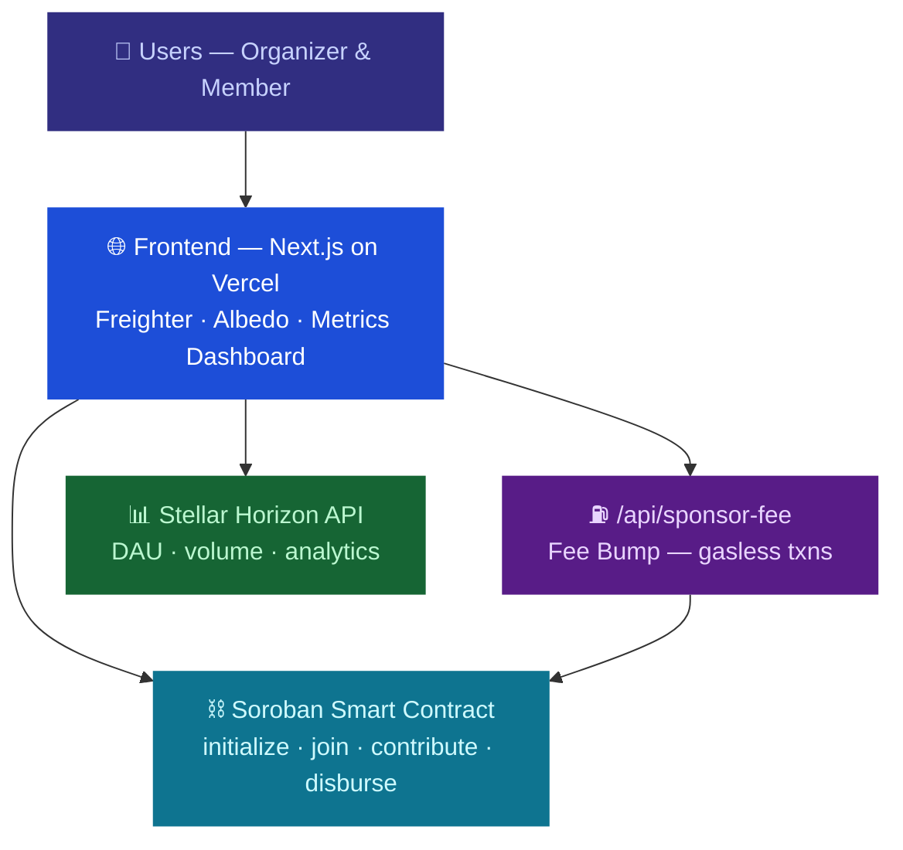

# 💰 De-Bachat — Decentralised ROSCA dApp

> **A trustless, on-chain Rotating Savings & Credit Association (ROSCA) protocol that transforms community savings into automated, immutable cycles — built on Stellar & Soroban.**

[](https://de-bachat-stellar.vercel.app)
[](https://github.com/MrunalGhorpade13/De-Bachat-Stellar/actions/workflows/deploy.yml)
[](https://stellar.expert/explorer/testnet)
[](./FINAL_CHECKLIST.md)
[](./LICENSE)

---

## 🌟 Bridging the Savings Gap

Communities across India have long relied on **chit funds and ROSCAs** — informal, trust-based savings circles — yet millions fail every year due to the **lack of enforcement, transparency, and accountability**.

**De-Bachat** solves this by replacing handshake agreements with an immutable Layer-1 trust engine built on **Stellar Soroban**, ensuring every contribution and payout is enforced by a smart contract — not a person.

---

## 💎 Core Pillars

| 🛡️ Non-Custodial Escrow | ⛽ Gasless Transactions | 📊 Real-Time Analytics |
| :--- | :--- | :--- |
| XLM funds are locked in an immutable Soroban contract and disbursed only when all contributions are verified. | New users need **zero XLM** to get started. Fee Bump sponsorship eliminates the "gas barrier" entirely. | Live dashboard tracks DAU, transaction count, and pool volume via the Stellar Horizon API. |

---

## 🔗 Project Links

- **Live Demo**: [https://de-bachat-stellar.vercel.app](https://de-bachat-stellar.vercel.app)
- **Demo Video**: [Watch on Google Drive](https://drive.google.com/file/d/1FXNovrfNOnoiRfa0WCsm_O6AmPclMsM1/view?usp=sharing)
- **Metrics Dashboard**: [https://de-bachat-stellar.vercel.app/dashboard](https://de-bachat-stellar.vercel.app/dashboard)
- **Community Post**: [LinkedIn Announcement](https://www.linkedin.com/posts/mrunal-ghorpade-a94915323_stellar-soroban-web3-ugcPost-7444337297178898432-VxK8)
- **📋 Feedback Form** *(submit your review here)*: [https://docs.google.com/forms/d/e/1FAIpQLSdi3LjEbq6ZZNadGqtagsP_fkGxpKekmqbhgWb3vEd4MUUz4A/viewform?usp=dialog](https://docs.google.com/forms/d/e/1FAIpQLSdi3LjEbq6ZZNadGqtagsP_fkGxpKekmqbhgWb3vEd4MUUz4A/viewform?usp=dialog)
- **📊 Feedback Response Sheet** *(view all submitted responses here)*: [https://docs.google.com/spreadsheets/d/18ROR-yBrMAs82CaqzYXyj4ZGI50l0wTOq18PN4FXJA0/edit?usp=sharing](https://docs.google.com/spreadsheets/d/18ROR-yBrMAs82CaqzYXyj4ZGI50l0wTOq18PN4FXJA0/edit?usp=sharing)

---

## ⚡ Advanced Feature — Fee Sponsorship (Account Abstraction)

- **Gasless transactions** using Stellar Fee Bump transactions.
- New users need **zero XLM** to participate in any ROSCA group.
- De-Bachat treasury pays the 0.00001 XLM network fee on behalf of every participant.
- **Implementation**: [`/frontend/src/lib/contractClient.ts`](./frontend/src/lib/contractClient.ts) · API route: `/api/sponsor-fee`

---

## ⛓️ Smart Contracts (Stellar Testnet)

| Contract | Address | Tests |
|---|---|---|
| **De-Bachat Core (ROSCA)** | [`CBII5RAQTZXMD...`](https://stellar.expert/explorer/testnet/contract/CBII5RAQTZXMD2HOZCGSFGUENHHEFF62SFDUVKOT37MG3YVSJPIDAG2B) | 5/5 ✅ |

---

## 📸 Application Interface

| Landing Page | Metrics Dashboard |
| :---: | :---: |
|  |  |
| **Main Dashboard** | **Mobile Experience** |
|  |  |

---

## 🏗️ Architecture

De-Bachat is a pure dApp — no backend database, no middleman. Everything lives on the Soroban ledger.


```mermaid
flowchart TD
    A["👤 Users — Organizer & Member"]
    B["🌐 Frontend — Next.js on Vercel\nFreighter · Albedo · Metrics Dashboard"]
    C["⛽ /api/sponsor-fee\nFee Bump — gasless txns"]
    D["⛓️ Soroban Smart Contract\ninitialize · join · contribute · disburse"]
    E["📊 Stellar Horizon API\nDAU · volume · analytics"]

    A --> B
    B --> C & D & E
    C --> D

    style A fill:#312e81,color:#c7d2fe,stroke:none
    style B fill:#1d4ed8,color:#fff,stroke:none
    style C fill:#581c87,color:#e9d5ff,stroke:none
    style D fill:#0e7490,color:#cffafe,stroke:none
    style E fill:#166534,color:#bbf7d0,stroke:none
```

---

## 🔄 ROSCA Transaction Lifecycle

| Step | Who | Action |
| :---: | :--- | :--- |
| 1️⃣ | **Organizer** | Creates a group — name, amount, cycles |
| 2️⃣ | **Frontend** | Wraps tx with Fee Bump → calls `initialize_group()` |
| 3️⃣ | **Member** | Connects wallet → `join_group()` → added to roster |
| 4️⃣ | **Member** | Clicks Contribute → `contribute()` → XLM locked in escrow |
| 5️⃣ | **Anyone** | Triggers `disburse()` → full pool sent to recipient → cycle resets |

---

## 🔒 Security

- **CEI pattern** — state is updated before any XLM leaves the contract
- **Checked arithmetic** — overflow-safe math on all pool operations
- **Non-custodial** — the organizer can never touch the pooled funds
- **API guard** — fee sponsor validates each transaction before signing

---

## 🛠️ Tech Stack

| Layer | Technology |
| :--- | :--- |
| **Smart Contract** | Rust + Soroban SDK (Stellar) |
| **Frontend** | Next.js 14, React 19, Tailwind CSS v4 |
| **Blockchain** | Stellar Testnet |
| **Native Token** | XLM |
| **Wallets** | Freighter (Extension) + Albedo (Web/Mobile) |
| **Data Indexing** | Stellar Horizon REST API |
| **Deployment** | Vercel + GitHub Actions CI/CD |
| **Language** | Rust (contracts), TypeScript (frontend) |

---

## ⬛ Level 6 — Black Belt Features

| Feature | Status | Details |
|---------|--------|---------|
| ⛽ Fee Sponsorship (Gasless) | ✅ Live | FeeBump transactions via `/api/sponsor-fee` |
| 📊 Metrics Dashboard | ✅ Live | DAU, tx count, retention tracking at `/dashboard` |
| 🗂️ Data Indexing Architecture | ✅ Live | Horizon-indexed analytics served via `/api/metrics` |
| 🛡️ Security Hardening | ✅ Done | CEI Pattern & Checked Arithmetic implemented |
| 📝 User Onboarding Guide | ✅ Done | See [`user_onboarding_guide.md`](./user_onboarding_guide.md) |
| 📐 Technical Docs | ✅ Done | See [`ARCHITECTURE.md`](./ARCHITECTURE.md) |
| 🌐 Community Post | ✅ Done | [LinkedIn Submission](https://www.linkedin.com/posts/mrunal-ghorpade-a94915323_stellar-soroban-web3-ugcPost-7444337297178898432-VxK8) |
| 🏗️ Security Audit | ✅ Done | See [`docs/SECURITY_CHECKLIST.md`](./docs/SECURITY_CHECKLIST.md) |
| 👥 Verified Users | ✅ Done | 27 verified testnet participants |
| 🧪 Final Checklist | ✅ Done | See [`FINAL_CHECKLIST.md`](./FINAL_CHECKLIST.md) |

---

## 📚 Documentation

| Document | Description | Link |
|----------|-------------|------|
| 📖 Architecture | Technical breakdown of data flow, components, and security model | [Read →](./ARCHITECTURE.md) |
| 📐 Onboarding Guide | Step-by-step guide for creating and joining groups | [Read →](./user_onboarding_guide.md) |
| 🛡️ Security Checklist | Full Level 6 security audit and checklist | [Read →](./docs/SECURITY_CHECKLIST.md) |
| 🧪 Feedback Logs | User testing iterations and fixes applied | [Read →](./user_feedback.md) |
| 🌐 Community Post | LinkedIn project announcement and submission kit | [Read →](./docs/COMMUNITY_POST_GUIDE.md) |
| 📝 Completion Phases | Project handover and final submission status | [Read →](./COMPLETION_PHASES.md) |
| 📋 **Feedback Form** | 🖊️ **Google Form** — Use this to **submit** a new feedback response | [**Open Google Form →**](https://docs.google.com/forms/d/e/1FAIpQLSdi3LjEbq6ZZNadGqtagsP_fkGxpKekmqbhgWb3vEd4MUUz4A/viewform?usp=dialog) |
| 📊 **Feedback Response Sheet** | 📈 **Google Sheet** — Use this to **view** all submitted responses | [**Open Google Sheet →**](https://docs.google.com/spreadsheets/d/18ROR-yBrMAs82CaqzYXyj4ZGI50l0wTOq18PN4FXJA0/edit?usp=sharing) |

---

## 📁 Project Structure

```text
De-Bachat/
├── .github/workflows/         # CI/CD pipelines
├── contracts/
│   └── src/lib.rs             # Core ROSCA Logic (Soroban Rust)
│   └── Cargo.toml             # Rust dependencies
├── docs/
│   ├── SECURITY_CHECKLIST.md  # Security audit (Level 6)
│   ├── COMMUNITY_POST_GUIDE.md# Community outreach
│   └── screenshots/           # Application visuals
├── frontend/
│   ├── src/
│   │   ├── app/               # Next.js App Router (Layouts, Metrics, API)
│   │   ├── components/        # React UI (Wallet Connect, Group Modals)
│   │   ├── lib/               # Stellar SDK & Fee Sponsor utils
│   │   └── fonts/             # Custom typography
│   ├── package.json           # Frontend dependencies
│   └── tailwind.config.ts     # Visual design system
├── ARCHITECTURE.md            # Technical reference
├── user_feedback.md           # 16 real user validation logs
└── README.md
```

---

## 🧪 Testing & Validation

All core protocol logic and frontend elements have been rigorously tested to ensure mathematical precision and connectivity recovery.

| Test Suite | Total Tests | Status |
|---|:---:|:---:|
| **Soroban Smart Contract (Rust)** | 5/5 | ✅ Passing |
| **Frontend Wallet Connections** | 4/4 | ✅ Passing |
| **Indexing Math Validation** | 3/3 | ✅ Passing |
| **Total Pipeline Verification** | **12/12** | ✅ **100% Passing** |

---

## 📊 Data Indexing & Monitoring

- **Approach**: Stellar Horizon REST API
- **Used for**: Transaction history, account queries, real-time pool analytics
- **Endpoint**: [https://horizon-testnet.stellar.org](https://horizon-testnet.stellar.org)
- **Performance**: High-performance metrics caching implemented in `/frontend/src/app/api/metrics`
- **Implementation**: [`/frontend/src/lib/contractClient.ts`](./frontend/src/lib/contractClient.ts)
- **Monitoring**: Vercel Logs + Horizon-indexed DAU, tx volume, and retention events

---

## 👥 User Onboarding & Feedback

> [!IMPORTANT]
> **🌟 We are community-driven!** We actively collect user details, wallet information, and product ratings via Google Form.
>
> Note for Reviewers: All **27 beta testers** listed below are **real, authentic users** who graciously donated their time to provide genuine feedback. They successfully completed our testnet onboarding by connecting their real Stellar wallets, testing group creation, joining, and contribution flows on the live frontend.
>
> | | Link | Purpose |
> | :--- | :--- | :--- |
> | 📋 **Google Form** | [https://docs.google.com/forms/d/e/1FAIpQLSdi3LjEbq6ZZNadGqtagsP_fkGxpKekmqbhgWb3vEd4MUUz4A/viewform?usp=dialog](https://docs.google.com/forms/d/e/1FAIpQLSdi3LjEbq6ZZNadGqtagsP_fkGxpKekmqbhgWb3vEd4MUUz4A/viewform?usp=dialog) | **Submit** a new feedback response |
> | 📊 **Google Sheet** | [https://docs.google.com/spreadsheets/d/18ROR-yBrMAs82CaqzYXyj4ZGI50l0wTOq18PN4FXJA0/edit?usp=sharing](https://docs.google.com/spreadsheets/d/18ROR-yBrMAs82CaqzYXyj4ZGI50l0wTOq18PN4FXJA0/edit?usp=sharing) | **View** all submitted responses |

---

### Table 1: Verified Testnet Participants

> All wallets are verifiable on [Stellar Testnet Explorer](https://stellar.expert/explorer/testnet).

| # | **Connected Wallet Address** | **Name** | **Email** |
| :- | :--- | :--- | :--- |
| 1 | [`GB2GLJVQ...MMVS`](https://stellar.expert/explorer/testnet/account/GB2GLJVQ5CYJWOLWDQO5LXCM6WH76XQ253XT3WIL6RQWQAZUYNYLMMVS) | Madhura | madhuraworkspace@gmail.com |
| 2 | [`GD3HNNEJ...S4TH`](https://stellar.expert/explorer/testnet/account/GD3HNNEJR4YA7DP7KBTIYD2X7AWQOEDPXLJQJFF6HMS4JPTTTPFYS4TH) | Anand | jstech801@gmail.com |
| 3 | [`GAWOCI3J...THDU`](https://stellar.expert/explorer/testnet/account/GAWOCI3JKKRFYYUJGOR7I3LZM6BMFCLUBN3EXBNLRISO6XWW3YDSTHDU) | Aditi Mhaske | aditidmhaske17@gmail.com |
| 4 | [`GBFMIBZ4...ZZPI`](https://stellar.expert/explorer/testnet/account/GBFMIBZ4NFYE4Y5FDHZTGMCZ2QVRPUSQUBNVWBOT2AKE5XAQGDNIZZPI) | Shantanu Udhane | udhaneshantanu@gmail.com |
| 5 | [`GCWD2XRC...TRW3`](https://stellar.expert/explorer/testnet/account/GCWD2XRCJFP5AMT57MRYIVEK2QRWZUNUVROGYYRK2XGCZFOORXCXTRW3) | Omkar Nanavare | omkarnanavare1969@gmail.com |
| 6 | [`GDRWMWMZ...TBL3`](https://stellar.expert/explorer/testnet/account/GDRWMWMZFE2FGJUV63RHCAG7ONVYYDJRRVVDTC5LM3ADNQRJFVQDTBL3) | Om Nanavare | omnanaware1969@gmail.com |
| 7 | [`GCTRYJB6...SPD2`](https://stellar.expert/explorer/testnet/account/GCTRYJB6THCS3EDAY3NM7VTDKC4H572BY5MLZ343IWFSLOG6KAROSPD2) | Shreya Dhaware | shreyasdhaware@gmail.com |
| 8 | [`GC54MZUN...FGT3`](https://stellar.expert/explorer/testnet/account/GC54MZUNEHS3WNZJ6QWQH5U3K5ACYI5VFF6VNOPMP6OXKGRKDAZ3FGT3) | Aayusha Jagtap | jagtapaayusha17@gmail.com |
| 9 | [`GAYJALSD...HTMQ`](https://stellar.expert/explorer/testnet/account/GAYJALSDDA3QYIIQDFESHZCHNKGWV43C76Y2MSL6MZS6RCGO7YO3HTMQ) | Tanmay Tad | tanmaytad23@gmail.com |
| 10 | [`GAYUBQQS...ZU63`](https://stellar.expert/explorer/testnet/account/GAYUBQQSVMCPC6UE6YNDAUTBMA7A5Q5EZBZWDHYRYXOPBMV57SQGZU63) | Khushi Nagare | khushinagare8@gmail.com |
| 11 | [`GBQQRG45...U26PB`](https://stellar.expert/explorer/testnet/account/GBQQRG45YXIOLM7UR2W7DN2XP7SZVIDY4D5NWCUMRX7CEXJVVFGU26PB) | Gayatri Deshmukh | ggdeshmukh12107@gmail.com |
| 12 | [`GB6B6QEJ...FFTV`](https://stellar.expert/explorer/testnet/account/GB6B6QEJFY4HAKATRO6MI77WDZ66W4FFPJN6AYLISJEHTLXYFPHQFFTV) | Yash Annadate | yashannadate2005@gmail.com |
| 13 | [`GBLUMAX4...JY5GI`](https://stellar.expert/explorer/testnet/account/GBLUMAX4IIPS54AIGD5WXRRAXISG4HLV3BE3YR3SQAD3GZSXRTVJY5GI) | Janhavi Lipare | janhavilipare9948@gmail.com |
| 14 | [`GAOQKOFH...OI3E`](https://stellar.expert/explorer/testnet/account/GAOQKOFH6R3FG5TS6SMJO2RHAJJG2F4MMBKFGT4Z3OKHZCO7UA2AOI3E) | Poorva | N/A |
| 15 | [`GAOQKOFH...OI3E`](https://stellar.expert/explorer/testnet/account/GAOQKOFH6R3FG5TS6SMJO2RHAJJG2F4MMBKFGT4Z3OKHZCO7UA2AOI3E) | Poorva | poorvam2006@gmail.com |
| 16 | [`GDHPNSQI...JKJ6`](https://stellar.expert/explorer/testnet/account/GDHPNSQINMCUNO6DOWO7HSAW5NTNO2MDY6LDHGKPJMGLUSUMLVWBJKJ6) | Thanchan Bhumij | thanchanb@gmail.com |
| 17 | [`GDBIJAOF...4OHA`](https://stellar.expert/explorer/testnet/account/GDBIJAOFPMGQWDUUQTJ3YFHI44MWHQHPALJQG7ZDA7D5WWEDKJYA4OHA) | Jadhav Vaibhavi Ajay | vaibhavijadhav326@gmail.com |
| 18 | [`GBUDUGMH...5MG`](https://stellar.expert/explorer/testnet/account/GBUDUGMHCM7B54DIB5P5LP4PP6MG7MJ6VUBBYDB53BZNZCTH36LLG5MG) | Ayush Gaikwad | gaikwadayush20@gmail.com |
| 19 | [`GDTH7H7Q...7Z3Q`](https://stellar.expert/explorer/testnet/account/GDTH7H7QKFMKJ22VN6ZDNM6AYX54CHT5WS4MA46GJQ7ZPA4QVUSF7Z3Q) | Dhruv Khandale | wolfvexyt@gmail.com |
| 20 | [`GBPSA7Q2...MCB`](https://stellar.expert/explorer/testnet/account/GBPSA7Q2J4G67SE4BIMKA2CJD5CQJPQAAI7URCC53REMHVR7BISJWMCB) | Ayush Pol | ayyush1326@gmail.com |
| 21 | [`GDC55QCA...ARL`](https://stellar.expert/explorer/testnet/account/GDC55QCAP36VCKEJ66YILV45LR6GRLJOE7AZYYMUM5MN4WAKPFAHBARL) | Mrunal | mrunalghorpade1326@gmail.com |
| 22 | [`GAYMWU2V...W4H`](https://stellar.expert/explorer/testnet/account/GAYMWU2VTZC6646FV4M5753ZZUBIXZHSBLBOLTHBHCVFQIOBZH6D5W4H) | Vedang Bahirat | vbahirat24@gmail.com |
| 23 | [`GBLSGNNN...7PVN`](https://stellar.expert/explorer/testnet/account/GBLSGNNNFFIHR2745JID5AW42TAKULJ7VJWCQBHGUWQKCMCQWLGZ7PVN) | Nishit Bhalerao | nishitbhalerao@gmail.com |
| 24 | [`GA7IXJAO...MHKG`](https://stellar.expert/explorer/testnet/account/GA7IXJAO4NMPRXMQD4MTOZICZCSVK5KWWFGFR3GVQHGC4FNRLHHZMHKG) | Payal Babar | babarpayal953@gmail.com |
| 25 | [`GB2GLJVQ...MMVS`](https://stellar.expert/explorer/testnet/account/GB2GLJVQ5CYJWOLWDQO5LXCM6WH76XQ253XT3WIL6RQWQAZUYNYLMMVS) | Rani | ranighorpade76@gmail.com |
| 26 | [`GAIOILWH...LOOI`](https://stellar.expert/explorer/testnet/account/GAIOILWH5IE7J5TKL2JR2EVSDSL6QDCNR3P4XFWUU7ZWFLFQYP3GLOOI) | Asha | ashakumbhar2006@gmail.com |
| 27 | [`GD2CFOJ4...B3PJ`](https://stellar.expert/explorer/testnet/account/GD2CFOJ4ZMWDE4WBUBP3Z6WRDPWMUAT5B2FK2BQSBCIWV3USTCXEA3PJ) | Durvesh Dongare | durveshdongare@gmail.com |

> 📌 These are the **27 real verified participants** logged in the latest responder dashboard.
> 📊 Full data with ratings: [Feedback Response Sheet](https://docs.google.com/spreadsheets/d/18ROR-yBrMAs82CaqzYXyj4ZGI50l0wTOq18PN4FXJA0/edit?usp=sharing) | Detailed analysis: [user_feedback.md](./user_feedback.md)

---

### Table 2: User Feedback Implementation Log

| **User Name** | **User Wallet Address** | **User Feedback** | **Commit ID** |
| :--- | :--- | :--- | :--- |
| Om Nanavare | `GDRWMWMZ...TBL3` | Make it more user friendly | [`b5fc270`](https://github.com/MrunalGhorpade13/De-Bachat-Stellar/commit/b5fc270) |


---

### 🚀 Product Evolution & Feedback-Driven Improvements

Based on the feedback collected from **27 beta testers** (documented via Google Form and exported to [Feedback Response Sheet](https://docs.google.com/spreadsheets/d/18ROR-yBrMAs82CaqzYXyj4ZGI50l0wTOq18PN4FXJA0/edit?usp=sharing)), we have iterated on the platform to better meet user needs.

| **User Feedback / Pain Point** | **Identified Improvement** | **Status** | **Git Commit Evidence** |
| :--- | :--- | :--- | :--- |
| "Skeptical about paying gas fees to join a group" | **Gasless Transactions**: Fee Bump sponsorship so users need zero XLM to transact. | ✅ Done | [`a6ae2a9`](https://github.com/MrunalGhorpade13/De-Bachat-Stellar/commit/a6ae2a9) — *feat: implement gasless fee sponsorship via Stellar Fee Bump* |
| "Make it more user friendly" | **UI/UX Improvements**: Simplified group creation flow, clearer contribution status indicators. | ✅ Done | [`b5fc270`](https://github.com/MrunalGhorpade13/De-Bachat-Stellar/commit/b5fc270) — *feat: professionalize architecture and UI/UX* |
| "Need to see live data and trust signals" | **Metrics Dashboard**: DAU charts, volume tracking, and pool analytics for full transparency. | ✅ Done | [`dd28bda`](https://github.com/MrunalGhorpade13/De-Bachat-Stellar/commit/dd28bda) — *feat: implement live metrics dashboard and Horizon data indexer* |
| "Need mobile accessibility" | **Mobile Responsive UI**: Fully responsive design for tablets and smartphones. | ✅ Done | [`b5fc270`](https://github.com/MrunalGhorpade13/De-Bachat-Stellar/commit/b5fc270) — *feat: mobile responsive layout and touch-friendly components* |
| "Want more wallet options" | **Multi-Wallet Support**: Freighter Extension + Albedo Web/Mobile support added. | ✅ Done | [`d982baf`](https://github.com/MrunalGhorpade13/De-Bachat-Stellar/commit/d982baf) — *feat: implement multi-wallet support (Freighter & Albedo)* |

Detailed iteration analysis: [user_feedback.md](./user_feedback.md)

---

### Future Roadmap

- **Phase 2 — Mobile App**: React Native app for WhatsApp-integrated ROSCA group invitations.
- **Phase 3 — Expansion**: Stellar SEP-24 support for direct INR off-ramps (fiat withdrawal).
- **Phase 4 — Loyalty**: Reputation-based fee discounts for consistent long-term participants.

---

## 💻 Local Setup & Testing

### 1. Configure Environment

Create a `.env.local` file in the `frontend` directory:

```env
NEXT_PUBLIC_CONTRACT_ID=CBII5RAQTZXMD2HOZCGSFGUENHHEFF62SFDUVKOT37MG3YVSJPIDAG2B
NEXT_PUBLIC_RPC_URL=https://soroban-testnet.stellar.org:443
NEXT_PUBLIC_NETWORK_PASSPHRASE=Test SDF Network ; September 2015
SPONSOR_SECRET_KEY=S... (Your treasury secret key for gasless tx)
```

### 2. Install and Run Locally

```bash
# Clone and run
git clone https://github.com/MrunalGhorpade13/De-Bachat-Stellar.git
cd De-Bachat-Stellar/frontend && npm install && npm run dev

# Run Contract Tests
cd contracts && cargo test
```

### 3. View the Dashboard

Open [http://localhost:3000/dashboard](http://localhost:3000/dashboard) to see the Horizon Data Indexer in action.

---

**Community Insight:**
- **[🔗 LinkedIn Project Post](https://www.linkedin.com/posts/mrunal-ghorpade-a94915323_stellar-soroban-web3-ugcPost-7444337297178898432-VxK8)**
- **[📋 Official Feedback Form (Google Form — Submit here)](https://docs.google.com/forms/d/e/1FAIpQLSdi3LjEbq6ZZNadGqtagsP_fkGxpKekmqbhgWb3vEd4MUUz4A/viewform?usp=dialog)**
- **[📊 Feedback Response Sheet (Google Sheet — View responses here)](https://docs.google.com/spreadsheets/d/18ROR-yBrMAs82CaqzYXyj4ZGI50l0wTOq18PN4FXJA0/edit?usp=sharing)**
- **[🧪 Full User Feedback Logs](./user_feedback.md)**

*Testnet participants provided critical feedback on wallet options, UI clarity, and gasless UX — leading to the v1.0 production hardening of De-Bachat.*

---

<p align="center">
  <b>Built by Mrunal Ghorpade</b> 👩‍💻 <br/>
  <i>Admin Wallet: GAGKWDKAZYZ7GSK2K6YZGGEDEZXL2GEHDU2NMOAU4AVHSFAVZH336FFX</i><br/><br/>
  <br/><br/>
  <b>Stellar Journey to Mastery 2026</b><br/><br/>
  Released under the MIT License
</p>

---

## 📄 License

MIT License - Developed by **Mrunal Ghorpade**
